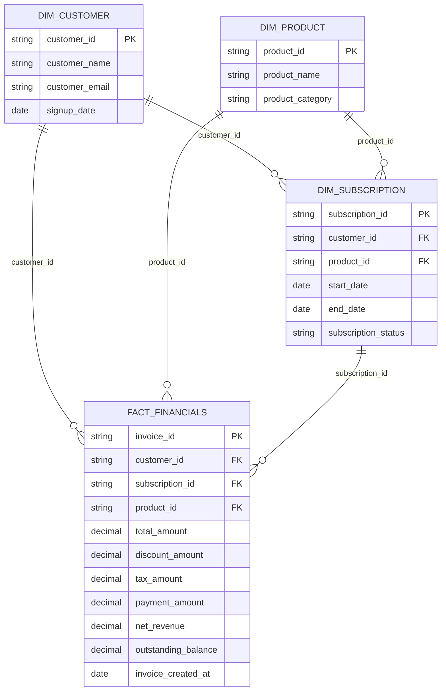

### ER Diagram

```mermaid

erDiagram

    %% Entities

    DIM_SUBSCRIPTION {
        string subscription_id PK
        string customer_id FK
        string product_id FK
        date start_date
        date end_date
        string subscription_status
    }

    DIM_CUSTOMER {
        string customer_id PK
        string customer_name
        string customer_email
        date signup_date
    }

    DIM_PRODUCT {
        string product_id PK
        string product_name
        string product_category
    }


    FACT_FINANCIALS {
        string invoice_id PK
        string customer_id FK
        string subscription_id FK
        string product_id FK
        decimal total_amount
        decimal discount_amount
        decimal tax_amount
        decimal payment_amount
        decimal net_revenue
        decimal outstanding_balance
        date invoice_created_at
    }

    %% Relationships
    
    
    DIM_CUSTOMER ||--o{ FACT_FINANCIALS : customer_id
    DIM_PRODUCT ||--o{ FACT_FINANCIALS : product_id
    DIM_SUBSCRIPTION ||--o{ FACT_FINANCIALS : subscription_id
    DIM_CUSTOMER ||--o{ DIM_SUBSCRIPTION : customer_id
    DIM_PRODUCT ||--o{ DIM_SUBSCRIPTION : product_id
   

```