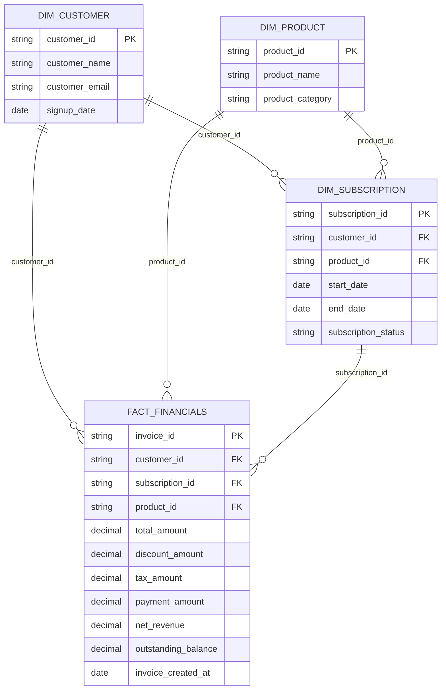

### ER Diagram

## Case Study: Subscription Data Pipeline for Customer Success
### Overview
This project demonstrates the design and implementation of a subscription-based data pipeline to support analytics and operational needs, particularly for the Customer Success team. The goal is to enable tracking of subscription renewals, cross-sell opportunities, and key business metrics like revenue, retention, and churn.

# Key Features
## Staging Layer:

Standardized raw data into clean, structured tables.
Includes tables for customers, subscriptions, invoices, payments, products, and events.

## Intermediate Layer:

Normalized entities such as customers, subscriptions, and invoice_payments.
Combines invoices and payments into a unified financial view.

## Mart Layer:

Dimensional models designed for analytical ease:
dim_customer, dim_product, and dim_subscription.
fact_financials consolidates financial metrics like revenue, payments, and discounts.

## Customer Success Use Case:

Highlights customers with upcoming subscription renewals and suggests cross-sell opportunities.
Data exposed via BI dashboards, email reports, and CRM integration.